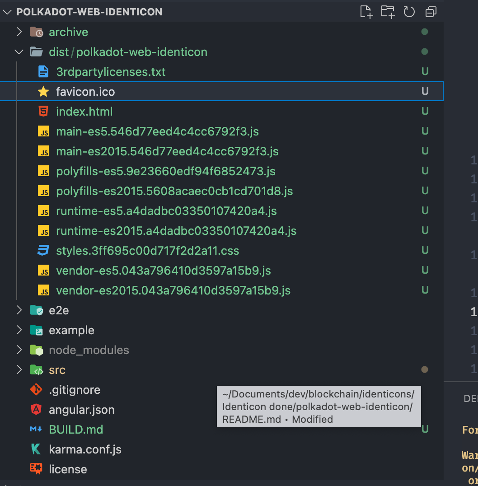
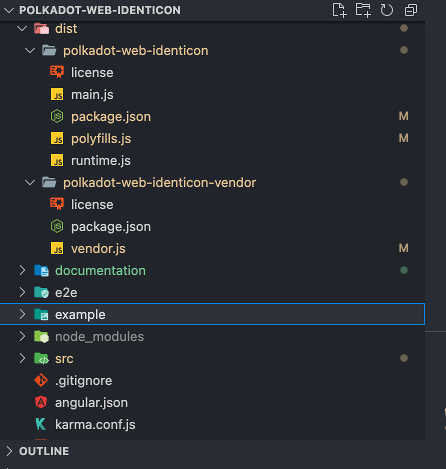

# Polkadot Web Identicon building guide 🏗

For Those wo want to build from this project or tweak it here is a guide of how the packages are built for release.

Note that the web component is based on the `polkadot-angular-identicon` component 

1) Install the Angular cli with `npm i -g @angular/cli`

2) Clone the project `polkadot-web-identicon` and open it into your favorite IDE.

3) Install dependencies with `npm i`

4) Open your IDE's terminal and type `ng build --prod`

A `dist` folder containing `polkadot-web-identicon` folder is created.
Inside the `dist/polkadot-web-identicon` you can see a couple of generated files :



The `relevant` files are the following:

    - ...
    - main-es5.[hash].js
    - main-es2015.[hash].js
    - polyfills-es5.[hash].js
    - polyfills-es2015.[hash].js 
    - runtime-es5.[hash].js 
    - runtime-es2015.[hash].js 
    - vendor-es5.[hash].js 
    - vendor-es2015.[hash].js.
    - ...

So The angular cli built files in `es5` and `es2015` and for your usage you can pick what you prefers.

A this point you can use the components

just by including in your html file like

```javascript
<script type="text/javascript" src="..../main-xxx.js"></script>
<script type="text/javascript" src="..../polyfills-xxx.js"></script>
<script type="text/javascript" src="..../runtime-xxx.js"></script>
<script type="text/javascript" src="..../vendor-xxx.js"></script>
```

and call the web component

```html 
    <polkadot-web-identicon address="5FHneW46xGXgs5mUiveU4sbTyGBzmstUspZC92UhjJM694ty" theme="jdenticon" size="120"></polkadot-web-identicon>
```


## How we published

For information, the package we published on npm is the `es2015` version and for convenience we splitted into 2 packages and renamed them by removing the `esxxx.hash` suffix:

- polkadot-web-identicon
- polkadot-web-identicon-vendor

 the latter one containing the vendor generated file.

 And the final structure before publishing to npm looks like this:

 


