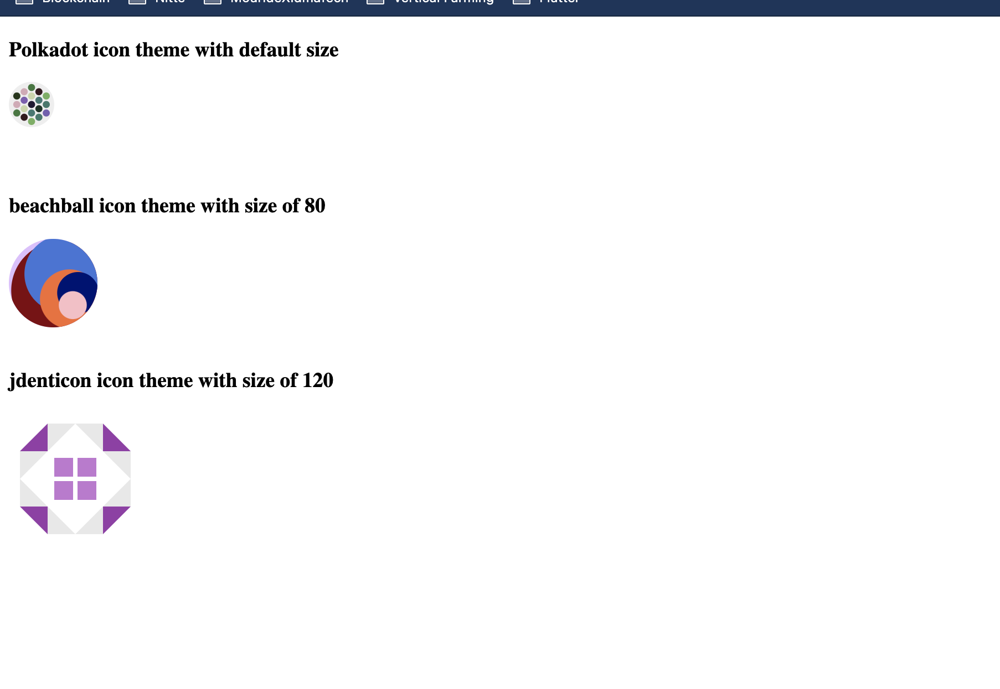

# How to use `polkadot-web-identicon` into your web application

The simplest way to use the component is to download it from npm

We assume you have `npm` and `node.js` installed in your environment.

1) create a folder with a name of your choice for example :
`pwi` (like polkadot-web-identicon 😎)

cd into the `pwi` (or the one you created) folder.

Type `npm init` to create the `package.json` file that will allow us to download packages from npm.

For simplicity sake, type enter for each question and at the end the `package.json` file should be created.

Create an index.html file that will contain the html and javascript code and past the following html snippet.

```html
<!DOCTYPE html>
<html lang="en">
<head>
    <meta charset="UTF-8">
    <meta http-equiv="X-UA-Compatible" content="IE=edge">
    <meta name="viewport" content="width=device-width, initial-scale=1.0">
    <title>Testing polkadot-web-identicon</title>
</head>
<body>

</body>
</html>
```

Now we can install the `polkadot-web-identicon` package from npm with :

 `npm i polkadot-web-identicon` 
After the installition completed we are ready to use the package we just need to do two things:

    - import the component library code files
    - call the component and use it with our parameters

These are the `attributes` that we can pass to the `polkadot-web-identicon` tag

`address` : the Substrate blockhain based address to pass as parameter

`theme` : the theme we want to display ( polkadot, beachball, jdenticon)

`size` : the size we want our identicon to be.

Our final structure in the index.html file will look like this:

```html

<!DOCTYPE html>
<html lang="en">
<head>
    <meta charset="UTF-8">
    <meta http-equiv="X-UA-Compatible" content="IE=edge">
    <meta name="viewport" content="width=device-width, initial-scale=1.0">
    <title>Testing polkadot-web-identicon</title>
</head>
<body>


    <h3>Polkadot icon theme  with default size</h3>
    <polkadot-web-identicon address="5FHneW46xGXgs5mUiveU4sbTyGBzmstUspZC92UhjJM694ty" theme="polkadot"></polkadot-web-identicon>
    <br>
    <h3>beachball icon theme  with size of 80 </h3>
    <polkadot-web-identicon address="5FHneW46xGXgs5mUiveU4sbTyGBzmstUspZC92UhjJM694ty" theme="beachball" size="80"></polkadot-web-identicon>
    <br>
    <h3>jdenticon icon theme  with size of 120</h3>
    <polkadot-web-identicon address="5FHneW46xGXgs5mUiveU4sbTyGBzmstUspZC92UhjJM694ty" theme="jdenticon" size="120"></polkadot-web-identicon>

<script type="text/javascript" src="node_modules/polkadot-web-identicon/main.js"></script>
<script type="text/javascript" src="node_modules/polkadot-web-identicon/polyfills.js"></script>
<script type="text/javascript" src="node_modules/polkadot-web-identicon/runtime.js"></script>
<script type="text/javascript" src="node_modules/polkadot-web-identicon-vendor/vendor.js"></script>

</body>
</html>
```

The rendered result should look like this



You can find a complete example in the [pwi](pwi) folder.

Voila ! That's it Happy coding 😎.


